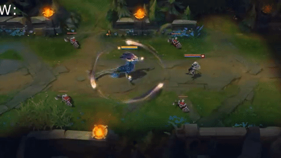
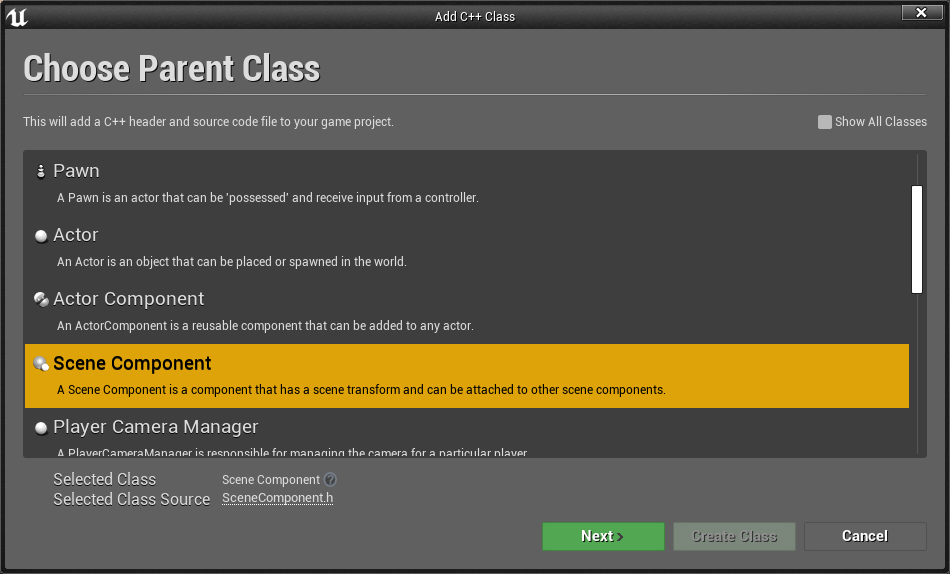
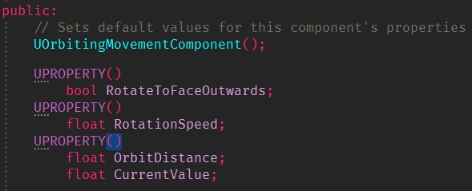
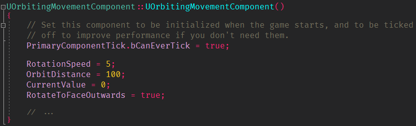
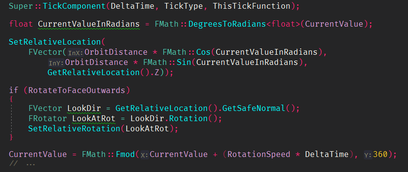
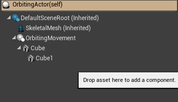
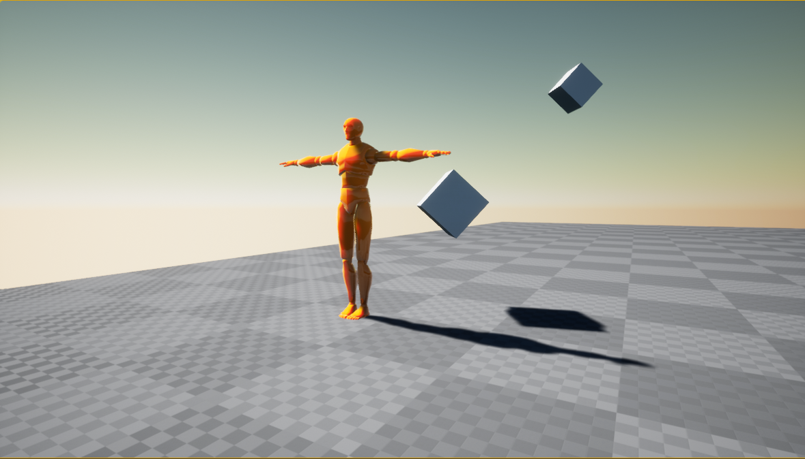

# 궤도를 선회하는 컴포넌트 만들기
> Orbiting: 궤도를 선회하는

### 1. 특징
종속된 컴포넌트가 특정방식으로 이동하도록 설계   
(Dependent Component is designed to move in a specific way.)

### 2. 방식
고정된 지점 주변의 궤도에 부착된 모든 컴포넌트를 고정된 거리에서 이동 시킵니다.

### 3. 예시

캐릭터 주위 보호막 느낌

 
LOL의 아우렐리온 솔의 위성
***
 

# 직접 구현해보자

### 1. SceneComponent 생성

C++ 파일로 새로운 SceneComponent를 생성합니다.   
OrbitingMovementComponent.cpp /  .h

### 2. 헤더파일 설정
 
새로 만들어진 헤더파일에 위와 같이 프로퍼티를 추가합니다.   
- RotateToFaceOutwards: 컴포넌트가 중앙과 반대편을 항상 바라보도록 할 것인지 결정합니다.
- RotationSpeed: 초당 회전하는 각도를 설정합니다.
- OrbitDistance: 회전체와 원점간의 거리를 설정합니다
- CurrentValue: 각도 단위로 계산한 현재의 회전 값 

### 3. CPP파일 설정

생성자 부분에서 해당 값들을 초기화 해줍니다.
  
각도를 도(Degree)가 아닌 라디안(Radian)으로 표현합니다.   
그러므로 DegreesToRadians함수를 사용해 도 단위의 현재 값을 라디안으로 변환합니다.
  
SetRelativeLocation 함수는 원형 이동을 위한 일반적인 수식으로 $Pos(\theta) = cos(\theta), sin(\theta)$ 를 사용합니다.   
z축 위치는 그대로 유지하도록 합니다.
  
RotateToFaceOutwards가 참이면, 오브젝트를 원점의 반대편으로 회전시킵니다.

컴포넌트의 상대적 오프셋을 부모로부터 가져오고 부모가 상대적 오프셋으로 가리키는 벡터를 기반으로 Rotator를 만듭니다.
그런 다음 상대적인 회전을 값으로 설정합니다.
  
마지막으로 각도 단위로 현재 값을 증가시켜 초당 RotationSpeed 단위만큼 이동합니다.   
이 작업은 0 ~ 360 도까지 반복수행됩니다.

> 해당 코드는 4.26 이상 버전에서는 그냥 사용 가능하지만   
> 만약 4.26 버전 미만 사용하고 해당 부분에서 오류가 출력된다면,   
> 다음과 같이 코드를 변경해야 합니다.
> - RelativeLocation.Z  —> GetRelativeLocation().Z
> - (RelativeLocation).GetSafeNormal() —> GetRelativeLocation().GetSafeNormal()

### 4. Actor에 추가하기
   
블루프린터로 생성한 기본 Actor에 위에서 만든 컴포넌트를 추가합니다.
기본 Actor에 OrbitingMovement를 추가하고 그 하위에 Cube를 추가해줍니다.

Viewport에 Actor를 올리면 위와 같이 나오며, 플레이시 Actor 주변을 선회하는 큐브를 볼 수 있습니다.